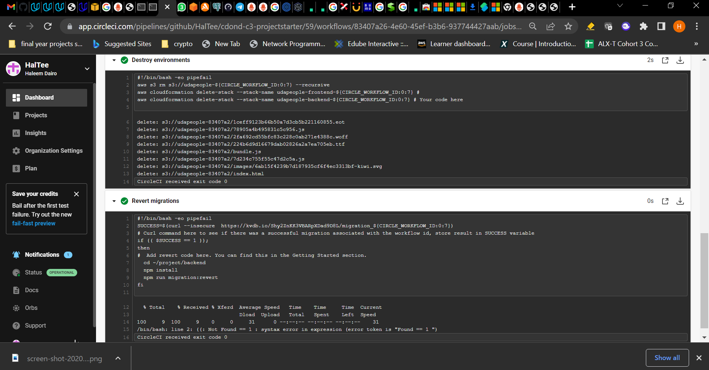
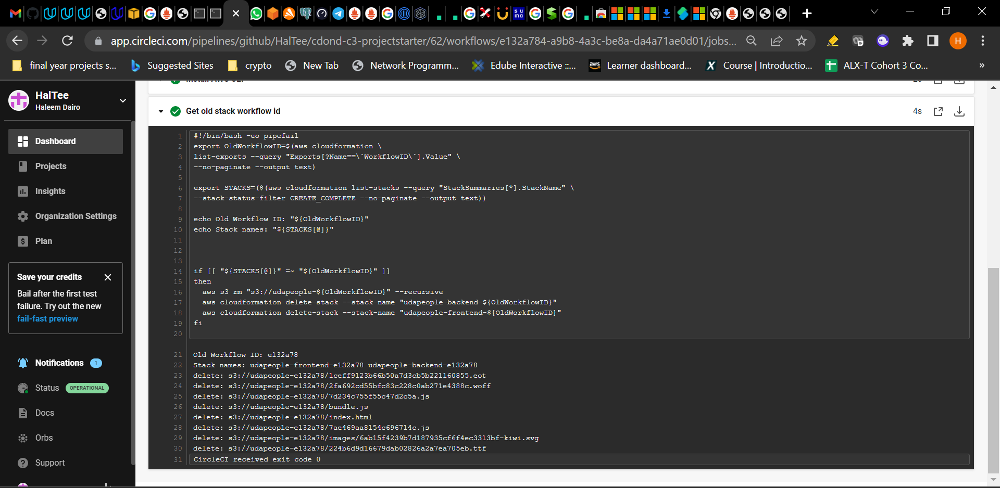

## Give your Application Auto-Deploy Superpowers

This project proves my mastery of the following learning objectives:

- Explain the fundamentals and benefits of CI/CD to achieve, build, and deploy automation for cloud-based software products.
- Utilize Deployment Strategies to design and build CI/CD pipelines that support Continuous Delivery processes.
- Utilize a configuration management tool to accomplish deployment to cloud-based servers.
- Surface critical server errors for diagnosis using centralized structured logging.

### Instructions

* [Selling CI/CD](instructions/0-selling-cicd.md)
* [Getting Started](instructions/1-getting-started.md)
* [Deploying Working, Trustworthy Software](instructions/2-deploying-trustworthy-code.md)
* [Configuration Management](instructions/3-configuration-management.md)
* [Turn Errors into Sirens](instructions/4-turn-errors-into-sirens.md)

### Project Submission

The following was submitted for the project

- A text file named `urls.txt` including:
  1. Public Url to GitHub repository (not private) [URL01]
  1. Public URL for your S3 Bucket (aka, your green candidate front-end) [URL02]
  1. Public URL for your CloudFront distribution (aka, your blue production front-end) [URL03]
  1. Public URLs to deployed application back-end in EC2 [URL04]
  1. Public URL to your Prometheus Server [URL05]

- Screenshots in JPG or PNG format, named using the screenshot number listed in the instructions.

  1. Job failed because of compile errors. [SCREENSHOT01]
  
  1. Job failed because of unit tests. [SCREENSHOT02]
  
  1. Job that failed because of vulnerable packages. [SCREENSHOT03]
  
  1. An alert from one of your failed builds. [SCREENSHOT04]
  
  1. Appropriate job failure for infrastructure creation. [SCREENSHOT05]
  
  1. Appropriate job failure for the smoke test job. [SCREENSHOT06]
  
  1. Successful rollback after a failed smoke test. [SCREENSHOT07]  
  
  1. Successful promotion job. [SCREENSHOT08]
  
  1. Successful cleanup job. [SCREENSHOT09]
  
  1. Only deploy on pushed to `master` branch. [SCREENSHOT10]
  .PNG
  1. Provide a screenshot of a graph of your EC2 instance including available memory, available disk space, and CPU usage. [SCREENSHOT11]
  
  1. Provide a screenshot of an alert that was sent by Prometheus. [SCREENSHOT12]
  

- Presentation for Selling CI/CD to management
- 

### Built With

- [Circle CI](www.circleci.com) - Cloud-based CI/CD service
- [Amazon AWS](https://aws.amazon.com/) - Cloud services
- [AWS CLI](https://aws.amazon.com/cli/) - Command-line tool for AWS
- [CloudFormation](https://aws.amazon.com/cloudformation/) - Infrastrcuture as code
- [Ansible](https://www.ansible.com/) - Configuration management tool
- [Prometheus](https://prometheus.io/) - Monitoring tool

### License

[License](LICENSE.md)
